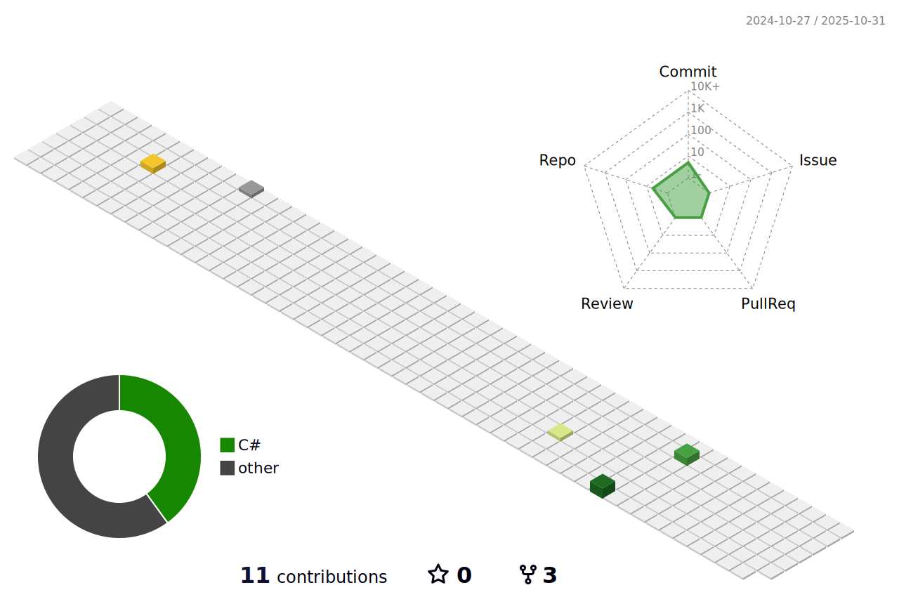

## Hello Humans! I am Ayush. 👋

- I am Ayush Kumar Dubey 
- Currently in 2 year of my B.Tech (IT). 
- I am Front End Web Dev. 
- I am open to collaborate on projects.

## Tech I know 👩‍💻 

### Language :

### Libraries & Framework :

### Tools:

## Stats 📊

 
 

  

<!--START_SECTION:activity-->
<!--END_SECTION:activity-->
<!--START_SECTION:activity-->
